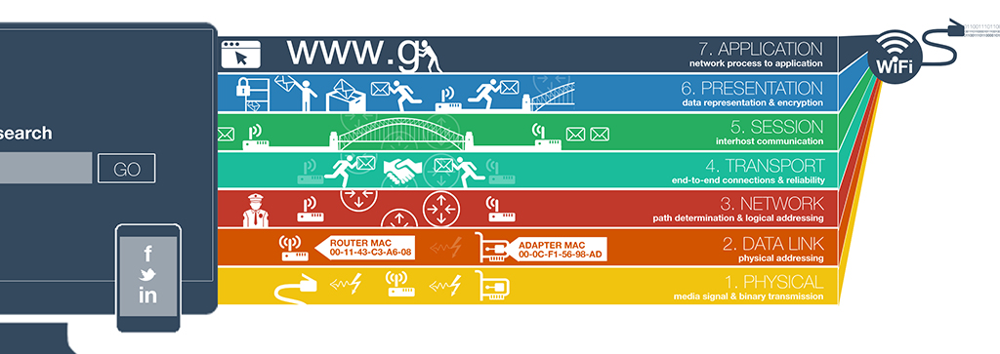
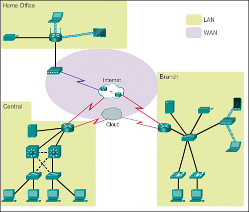
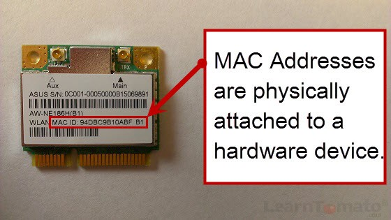

# alx-system_engineering-devops

## 0. OSI model ##
OSI (Open Systems Interconnection) is an abstract model to describe layered communication and computer network design. The idea is to segregate the different parts of what make communication possible.

It is organized from the lowest level to the highest level:

* The lowest level: layer 1 which is for transmission on physical layers with electrical impulse, light or radio signal
* The highest level: layer 7 which is for application specific communication like SNMP for emails, HTTP for your web browser, etc

Keep in mind that the OSI model is a concept, it’s not even tangible. The OSI model doesn’t perform any functions in the networking process. It is a conceptual framework so we can better understand complex interactions that are happening. Most of the functionality in the OSI model exists in all communications systems.

In this project we will mainly focus on:

* The Transport layer and especially TCP/UDP
* On the Network layer with IP and ICMP

The image bellow describes more concretely how you can relate to every level.

Questions:

What is the OSI model?

1. Set of specifications that network hardware manufacturers must respect
2. The OSI model is a conceptual model that characterizes the communication functions of a telecommunication system without regard to their underlying internal structure and technology
3. The OSI model is a model that characterizes the communication functions of a telecommunication system with a strong regard for their underlying internal structure and technology

How is the OSI model organized?

1. Alphabetically
2. From the lowest to the highest level
3. Randomly

## 1. Types of network ##

LAN connect local devices together, WAN connects LANs together, and WANs are operating over the Internet.

Questions:

What type of network a computer in local is connected to?

1. Internet
2. WAN
3. LAN

What type of network could connect an office in one building to another office in a building a few streets away?

1. Internet
2. WAN
3. LAN

What network do you use when you browse www.google.com from your smartphone (not connected to the Wifi)?

1. Internet
2. WAN
3. LAN

## 2. MAC and IP address ##

Questions:

What is a MAC address?

1. The name of a network interface
2. The unique identifier of a network interface
3. A network interface

What is an IP address?

1. Is to devices connected to a network what postal address is to houses
2. The unique identifier of a network interface
3. Is a number that network devices use to connect to networks

